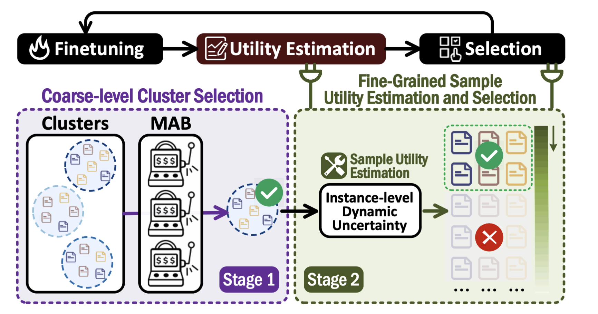
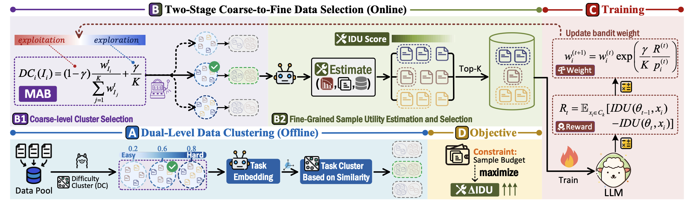

<h1 align="center">🔥 Iterative Data Selection for Efficient LLM Instruction Tuning</h1>
<h4 align="center">🚧 Please note that this repository is still under construction! 🚧</h4>

<h4 align="center"> ✨ Official repository for the paper "Iterative Data Selection for Efficient LLM Instruction Tuning"</h4>


<div align="center">
  
</div>

## 📢 News

[May 09, 2025] LEAD is publicly released ! \
[May 09, 2025] We released our [data pool](https://huggingface.co/datasets/lxtlxt/leadData) !


## 📋 Overview
Instruction tuning has emerged as a critical paradigm for improving the capabilities and alignment of large language models (LLMs). However, existing iterative model-aware data selection methods incur significant computational overhead, as they rely on repeatedly performing full-dataset model inference to estimate sample utility for subsequent training iterations, creating a fundamental efficiency bottleneck.

In this paper, we propose LEAD, an efficient iterative data selection framework that accurately estimates sample utility entirely within the standard training loop, eliminating the need for costly additional model inference. At its core, LEAD introduces Instance-Level Dynamic Uncertainty (IDU), a theoretically grounded utility function combining instantaneous training loss, gradient-based approximation of loss changes, and exponential smoothing of historical loss signals. To further scale efficiently to large datasets, LEAD employs a two-stage, coarse-to-fine selection strategy, adaptively prioritizing informative clusters through a multi-armed bandit mechanism, followed by precise fine-grained selection of high-utility samples using IDU. Extensive experiments across four diverse benchmarks show that LEAD significantly outperforms state-of-the-art methods, improving average model performance by 6.1%-10.8% while using only 2.5% of the training data and reducing overall training time by 5-10×.

<div align="center">
  
</div>

## 🔗 Quick Links
- [📢 News](#-news)
- [📋 Overview](#-overview)
- [⚙️ Environment Setup](#-environment-setup)
- [📥 Data Preparation](#-data-preparation)
- [🌠 Running LEAD](#-running-lead)
  - [Step 1: Warmup Training](#step-1-warmup-training)
  - [Step 2: Data Processing Pipeline (Offline)](#step-2-data-processing-pipeline-offline)
  - [Step 3: Two-Stage Coarse-to-Fine Data Selection and Training (Online)](#step-3-two-stage-coarse-to-fine-data-selection-and-training-online)
  - [Step 4: Evaluation](#step-4-evaluation)

## ⚙️ Environment Setup

1. Clone the repository
    ```bash
    git clone https://github.com/HKUSTDial/LEAD.git
    cd LEAD
    ```

2. Create and activate a conda environment:
    ```bash
    conda create --name lead python=3.10.15
    conda activate lead
    pip install -r requirements.txt
    ```

## 📥 Data Preparation
We follow the [open-instruct](https://github.com/allenai/open-instruct?tab=readme-ov-file#dataset-preparation) repo to prepare eight instruction tuning datasets. In our project, we utilize a combination of eight training datasets: WizardLM (ShareGPT) , WizardLM (Alpaca), UltraChat, unnatural, Alpaca code, Standard Alpaca, MATH and GSM8K. 

A processed version of these files are available [here](https://huggingface.co/datasets/lxtlxt/leadData).


## 🌠 Running LEAD
### Step 1: Warmup Training
1. Edit ```run_warmup_training.sh``` to set your own ```BASE_DIR```, ```TRAIN_FILE```, ```MODEL_NAME_OR_PATH``` and ```OUTPUT_DIR```
    ```
    export CUDA_VISIBLE_DEVICES=0,1,2,3                 # Set your CUDA
    BASE_DIR="/path/to/LEAD"                            # Root for the project
    TRAIN_FILE="/path/to/random_6k_data.jsonl"          # path to training data(6k) randomly selected in the data pool
    MODEL_NAME_OR_PATH="/path/to/pretrained_model"      # Dir to the pretrained model to finetune the warmup model
    OUTPUT_DIR="/path/to/save/warmup_model"             # Dir to save the warmup model
    ```

2. Run the following script to train a warm up model for difficulty clustering
    ```bash
    bash scripts/run_warmup_training.sh
    ```
Note: We only use 6k data in the data pool to train this model.


### Step 2: Data Processing Pipeline (Offline)
1. Edit ```run_scoring.sh``` to set your own ```BASE_DIR```, ```MODEL_NAME_OR_PATH``` and  ```OUTPUT_DIR```
    ```
    export CUDA_VISIBLE_DEVICES=0,1,2,3              # Set your CUDA
    BASE_DIR="/path/to/LEAD"                         # Root for the project
    WARMUP_MODEL_PATH="/path/to/warmup_model"        # Dir to the warmup model trained in Step 1
    BASE_MODEL_PATH="/path/to/pretrained_model"      # Dir to the pretrained model to get the initial iu score
    OUTPUT_DIR="/path/to/save/data_pool"             # Dir to save the processed data pool to train lead
    ```

2. Run the following script to generate initial cluster training data. This script contains the following steps:
   * Calculating Difficulty Scores
   * Calculating Initial IU Scores
   * Performing Clustering
   
    ```bash
    bash scripts/run_scoring.sh
    ```


### Step 3: Two-Stage Coarse-to-Fine Data Selection and Training (Online)

1. Edit ```run_lead.sh``` to set your own ```BASE_DIR```, ```MODEL_NAME_OR_PATH```, ```NUM_GPUS``` and ```OUTPUT_DIR```.
    ```
    export CUDA_VISIBLE_DEVICES=0,1,2,3        # Set your CUDA
    BASE_DIR="/path/to/LEAD"                   # Root for the project
    MODEL_NAME_OR_PATH="/path/to/model"        # Dir to pretrained model to train lead
    NUM_GPUS=4                                 # Number of GPUs
    OUTPUT_DIR="/path/to/save/sft_model"       # Dir to save sft model
    ```

2. Run the following script
    ```bash
    bash scripts/run_lead.sh
    ```

### Step 4: Evaluation
We follow the instructions in the [open-instruct](https://github.com/allenai/open-instruct/tree/main/scripts/eval) folder to evaluate the performance of the model trained on the selected data.
1. Merge the lora model
    ```bash
    bash scripts/lora_merge.sh
    ```
   
2. Evaluate diverse benchmarks
    ```bash
    bash scripts/eval.sh
    ```


